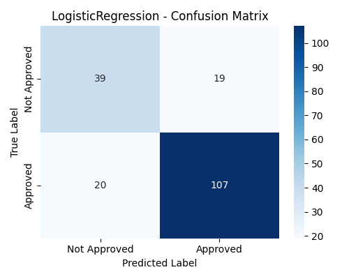
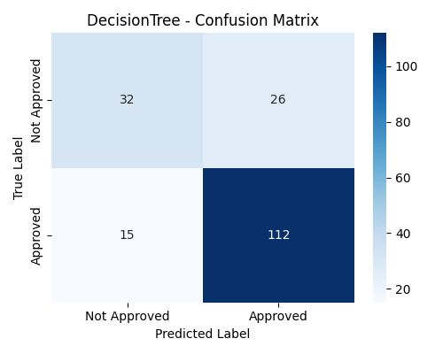
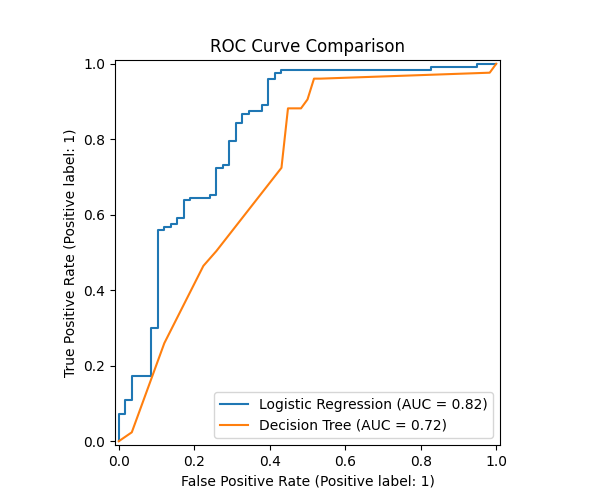

# 📌 Task 4: Loan Approval Prediction

## 📖 Description

This project predicts whether a loan application will be **approved** or **not approved** using machine learning techniques. The dataset is the **Loan-Approval-Prediction-Dataset** (Kaggle).

We focus on:

* **Binary Classification** (Approved ✅ / Not Approved ❌)
* **Imbalanced Data Handling** using SMOTE
* **Evaluation with Precision, Recall, F1-score, and ROC-AUC**

---

## 📂 Dataset

* File: `loan_data_set.csv`
* Features:

  * Loan\_ID
  * Gender
  * Married
  * Dependents
  * Education
  * Self\_Employed
  * ApplicantIncome
  * CoapplicantIncome
  * LoanAmount
  * Loan\_Amount\_Term
  * Credit\_History
  * Property\_Area
* Target: **Loan\_Status** (`Y` = Approved, `N` = Not Approved)

---

## ⚙️ Steps Performed

### 1. Data Preprocessing

* Handled **missing values**
* Encoded **categorical features** with `LabelEncoder`
* Standardized numerical features with `StandardScaler`

### 2. Train-Test Split

* 80% training data, 20% testing data

### 3. Imbalanced Data Handling

* Applied **SMOTE** to oversample the minority class in training data
* Ensured test data remains unchanged for fair evaluation

### 4. Models Used

* **Logistic Regression** (baseline model)
* **Decision Tree Classifier** (non-linear model)

### 5. Evaluation Metrics

* Confusion Matrix
* Precision, Recall, F1-Score
* ROC Curve & AUC Score

---

## 📊 Results

### Logistic Regression

* Balanced performance
* Good trade-off between precision & recall

**Confusion Matrix:**



### Decision Tree

* Slight overfitting tendency
* Lower generalization compared to Logistic Regression

**Confusion Matrix:**


### ROC Curve Comparison



### Class Distribution (Before & After SMOTE)


---

## 🚀 How to Run

1. Clone this repository

```bash
 git clone <repo-link>
 cd loan-approval-prediction
```

2. Install dependencies

```bash
 pip install -r requirements.txt
```

3. Run the Jupyter Notebook or Python script

```bash
 python loan_approval_prediction.py
```

4. Check results in terminal and plots in `images/` folder

---

## 📌 Key Learnings

* Loan Approval Prediction is a **binary classification** problem
* **Imbalanced datasets** must be handled carefully (SMOTE works well)
* Logistic Regression provides **baseline interpretability**
* Decision Trees capture **non-linear relations** but may overfit

---

